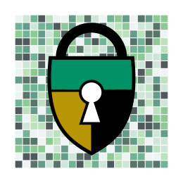

<!-- $theme: gaia -->

### Cyber Attack ==Demonstrations==

# 

##### Presented by 
###### Scott Shapiro, Professor of Law and Philosophy, YLS
###### Sean O'Brien, Visiting Fellow, Yale Privacy Lab

###### scott.shapiro@yale.edu | sean.obrien@yale.edu

###### 
<!-- Creative Commons Attribution-ShareAlike -->

----

#### YouTube Channel: [frama.link/yalecyber01](https://frama.link/yalecyber01)
#### Source Code Repo: [frama.link/yalecyber02](https://frama.link/yalecyber02)

# 

#### Contact us:
###### scott.shapiro@yale.edu | sean.obrien@yale.edu

###### 
<!-- Creative Commons Attribution-ShareAlike -->
